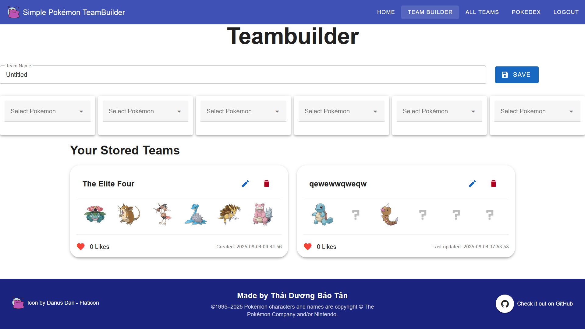
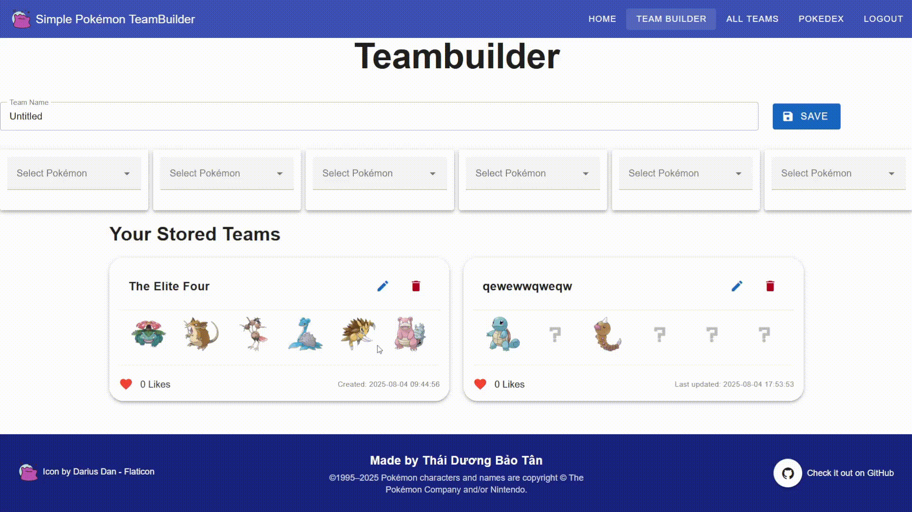
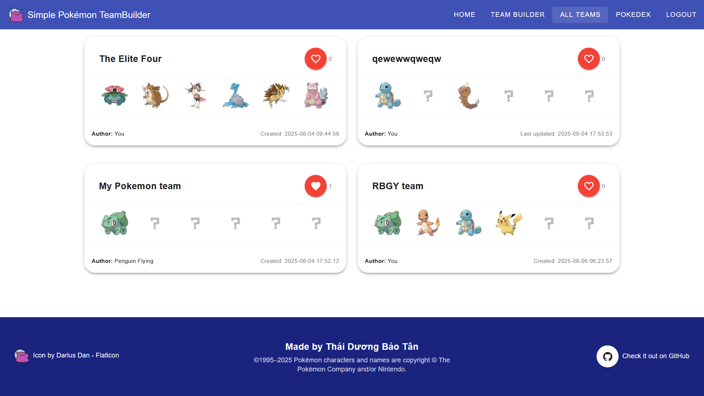
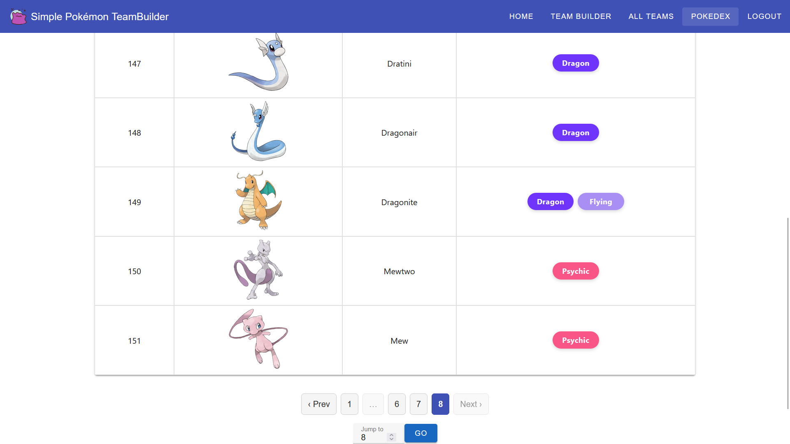

<h1 align="center">Simple Pokémon Teambuilder</h1>
<p align="center">
  A school project that lets you create and share simple Pokémon teams.
</p>
<p align="center">
  <a href="https://your-deployed-link.com">
    
  </a>
</p>
<details>
  <summary>📑 Table of Contents</summary>
- [About The Project](#about-the-project)
- [Getting Started](#getting-started)
- [Installation](#installation)
- [Usage](#usage)
- [Contact](#contact)
- [Acknowledgments](#acknowledgments)
</details>
---

## About The Project



**Simple Pokémon Teambuilder** is a school project that allows you to form a simple Pokémon team.  
It is *simple* because:
- Supports **Generation 1 only**
- No moveset feature (yet)

However, despite that limitation, it includes:
- A public **Teams Gallery** where you can browse others’ teams.
- Ability to **like** teams you admire.
### Built With

- [](https://vuejs.org/)
- [](https://vuetifyjs.com/)
- [](https://www.php.net/)
- [](https://www.sqlite.org/)
---

## Getting Started

Before setting up the project, ensure you have installed:
- [Composer (latest version)](https://getcomposer.org/)
- [Node.js and npm (latest version)](https://nodejs.org/)
- [SQLite](https://www.sqlite.org/download.html)
---

## Installation

1. **Clone the repository**
```bash
git clone https://github.com/your-username/simple-pokemon-teambuilder.git
cd simple-pokemon-teambuilder
```
2. **Backend setup**
```bash
cd backend
composer install
```
**Configure Environment Variables
2.1. Copy the example .env file:
``` bash
cp .env.example .env
```
2.2. Open `.env` in your editor and replace the placeholder value with your actual configuration.
**Notes**:
- Replace `YOUR_DATABASE_HOST`, `YOUR_FRONTEND_URL`, etc., with your actual values.
- The `GOOGLE_REDIRECT_URI` must match the redirect URI configured in your Google API Console.
3. **Frontend setup**
``` bash
cd ../frontend
npm install
```
**Configure Environment Variables**
3.1 Copy the example .env file:
```bash
cp .env.example .env
````
3.2. Open `.env` in your editor and replace the placeholder value with your actual configuration.
4. **Start the Dev Server**
```bash
npm run dev
```
5. **Access the App**
```bash
http://localhost:<your-port>
```
*Replace <your-port> with the one shown in your terminal after running npm run dev.*

## Usage
> **Note:** For the full experience, you need to log in with your Google account.
1. **Create a Team**  

2. **Browse Other Teams**  

3. **Explore the Pokédex**  

## Contact
Thái Dương Bảo Tân – baotan1909@gmail.com
## Acknowledgments
- Thanks to [**PokéAPI**](https://pokeapi.co/) for providing a comprehensive and freely accessible API for Pokémon data.  
- All Pokémon content and materials are **&copy; The Pokémon Company**. This project is a fan-made work and is not affiliated with or endorsed by The Pokémon Company.